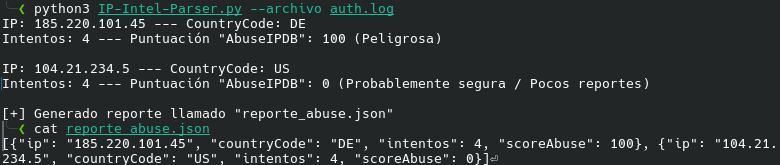

# 🔍 IP Threat Intel Parser

Herramienta CLI desarrollada en Python para enriquecer logs de autenticación SSH consultando la API de **AbuseIPDB**. Detecta IPs sospechosas, obtiene su puntuación de reputación y país de origen, y genera un reporte estructurado en JSON listo para integrarse en flujos de trabajo.

## Características

- **Integración con AbuseIPDB**: Consulta automática de reputación para cada IP sospechosa detectada
- **Geolocalización**: Obtiene el país de origen de cada IP directamente desde la API
- **Umbral Configurable**: Define a partir de cuántos intentos fallidos se considera una IP sospechosa (ej. alerta si hay más de 5 intentos)
- **Reporte JSON**: Exporta los resultados listos para ingestión en SIEMs o pipelines.
- **Dependencias mínimas**: Requiere `requests` como dependencia externa; el resto son librerías estándar (`re`, `json`, `argparse`)
- **Interfaz CLI**: Argumentos flexibles mediante `argparse`

## Requisitos

- **Python 3.6+**
- **API Key de AbuseIPDB** — [Regístrate para obtener una key gratuítamente](https://www.abuseipdb.com/register)
- **Archivo log Linux** (ej. `/var/log/auth.log` o simulado)

## Instalación

**Clona el repositorio**

```bash
git clone https://github.com/Pocee/ip-threat-intel-parser
cd ip-threat-intel-parser
```

**Instala la única dependencia externa**

```bash
pip install requests
```

**Configura tu API Key**

Abre `parser.py` y sustituye el valor de `api_key` con tu clave de AbuseIPDB:

```python
api_key = "TU_API_KEY_AQUI"
```

## Uso

#### Uso básico (umbral por defecto: 3 intentos)

```bash
python3 parser.py --archivo auth.log
```

#### Definir umbral de alerta personalizado (>10 intentos fallidos)

```bash
python3 parser.py --archivo auth.log --umbral 10
```

El script generará automáticamente un archivo `reporte_abuse.json` con las IPs que superaron el umbral.

## Estructura del reporte JSON

```json
[
  {
    "ip": "192.168.1.105",
    "countryCode": "CN",
    "intentos": 47,
    "scoreAbuse": 98
  },
  {
    "ip": "10.0.0.23",
    "countryCode": "RU",
    "intentos": 12,
    "scoreAbuse": 15
  }
]
```

| Campo | Descripción |
|---|---|
| `ip` | Dirección IP detectada |
| `countryCode` | País de origen según AbuseIPDB |
| `intentos` | Número de intentos fallidos en el log |
| `scoreAbuse` | Puntuación de reputación (0–100). ≥25 se considera peligrosa |

## Casos de uso

- **Respuesta a incidentes**: Identificar y priorizar IPs atacantes en logs de servidores combinando frecuencia de ataque + reputación externa
- **Hardening de servidores**: Generar blacklists de IPs para configurar reglas en `iptables` o `fail2ban`
- **Integración SOC**: El JSON generado es directamente ingestable por SIEMs como Splunk, Elastic o cualquier pipeline personalizado

## Ejemplo en mi terminal



## Proyectos relacionados

Este proyecto es la evolución natural de [SSH Brute-Force Detector & Log Parser](https://github.com/Pocee/ssh-bruteforce-detector), que aplica el mismo análisis de logs pero sin enriquecimiento externo por APIs.

## Authors

- [@Pocee](https://www.github.com/Pocee)

Como parte de mi portfolio de automatización de sistemas y ciberseguridad.
